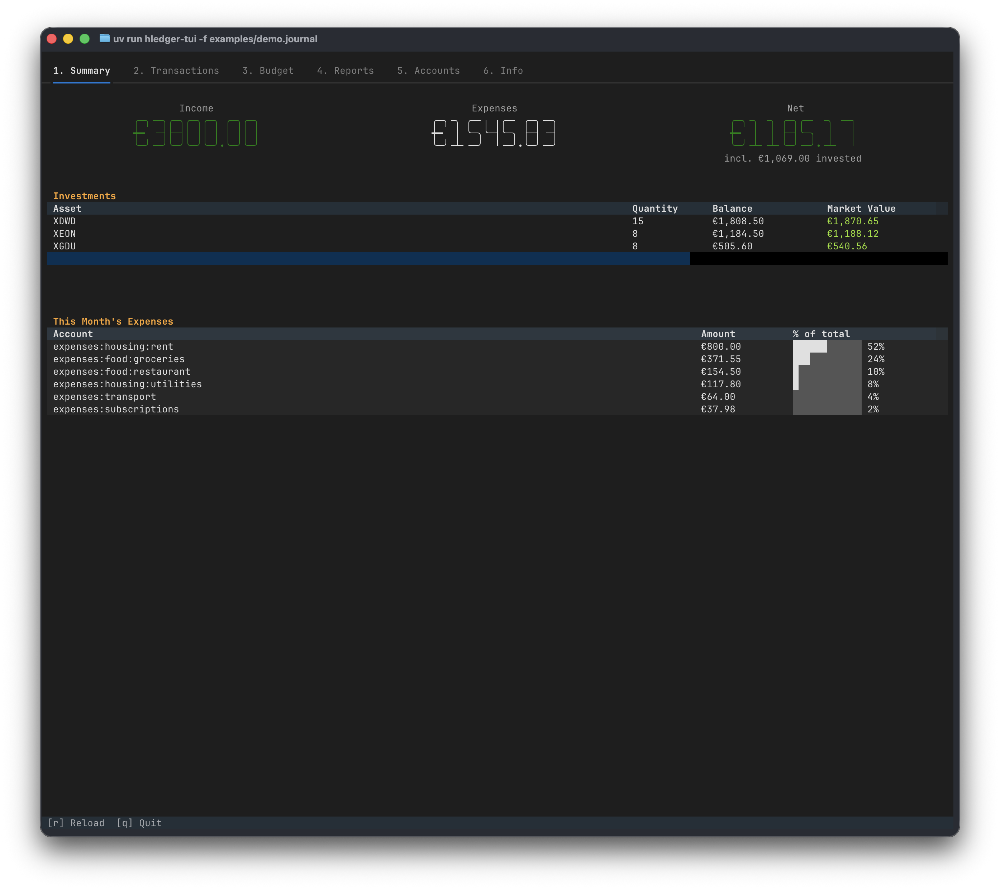

# hledger-textual

[](https://pypi.org/project/hledger-textual/)

A terminal user interface for managing [hledger](https://hledger.org) journal transactions. View, create, edit, and delete transactions from your terminal.

Built with [Textual](https://textual.textualize.io) and Python.



## Stack

- **Python 3.12+**
- **Textual** - TUI framework
- **hledger** - plain-text accounting (must be installed separately)
- **uv** - package manager (no `requirements.txt` needed, dependencies are in `pyproject.toml`)
- **pytest** - testing

## Requirements

- Python 3.12+
- [hledger](https://hledger.org/install.html) installed and available in `PATH`

## Installation

```bash
# With pipx
pipx install hledger-textual

# With uv
uv tool install hledger-textual

# With Homebrew
brew tap thesmokinator/hledger-textual && brew install hledger-textual
```

## Usage

```bash
hledger-textual -f path/to/your.journal
```

The journal file is resolved in this order:

1. `-f` / `--file` CLI argument
2. `LEDGER_FILE` environment variable
3. `~/.config/hledger-textual/config.toml` (`journal_file` key)
4. `~/.hledger.journal`

## Key Bindings

| Key           | Action                           |
|---------------|----------------------------------|
| `a`           | Add new transaction              |
| `e` / `Enter` | Edit selected transaction       |
| `d`           | Delete (with confirmation)       |
| `/`           | Filter by description or account |
| `Escape`      | Clear filter                     |
| `r`           | Refresh from journal file        |
| `j` / `k`     | Navigate up/down                |
| `q`           | Quit                             |

## Documentation

See [DOCS.md](DOCS.md) for the full documentation: feature overview, configuration, investment tracking, and per-tab reference.

## Development

```bash
git clone https://github.com/thesmokinator/hledger-textual.git
cd hledger-textual
uv sync
```

### Testing

```bash
# Run all tests
uv run pytest

# Run with verbose output
uv run pytest -v

# Run with coverage report
uv run pytest --cov=hledger_textual --cov-report=term-missing
```
